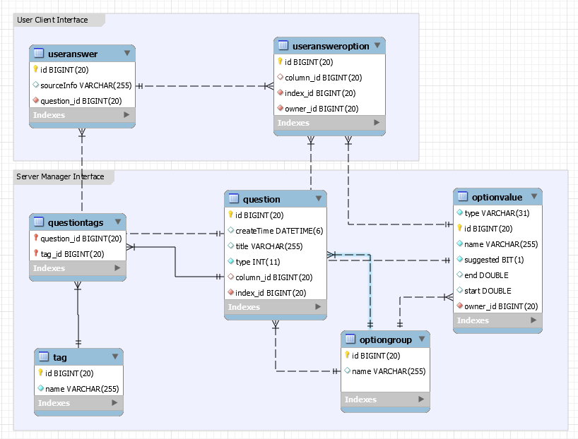
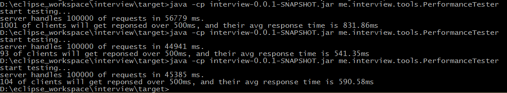

# InsticatorInterview

### 1. Design

Use matrix representation for all kinds of questions. Think of other type of 
question as a matrix only has one column.

Add **tag** attribute to question for searching purpose

Add **option group** table for data reuse purpose, since many questions may share
the same options

The data model graph is showing below:

The **User Client Interface** is for client user submit their 
answers to server

The **Server Manager Interface** is for crud operations in 
server manager panel (I made a very simple one for test purpose)

### 2. Tools & Frameworks

Used following frameworks

* **JPA**(Hibernate Implementation) for data persisting
* **Lucene**(Hibernate Search Integration) for question fuzzy search
* **Spring Core** for Dependency Injection, And Inverse of Control
* **Spring Web MVC** for Controller (Request Mapping & Handling)
* **Jsp Jstl** for view

### 3. Restful-Service API

**GET** `/api/getQuestions/[?term=[search_key]]`

 Response Code:

* 400 Bad Request for reject
* 202 Accepted    for accept With Body [`application/json`]

	//e.g. response for http://localhost:8080/api/getQuestions?term=gaming
	[{
	  "id" : 6,
	  "title" : "Describe your favorite brand of gaming equipment.",
	  "type" : "matrix",
	  "index" : {
	    "id" : 8,
	    "name" : "Gaming Equipment",
	    "options" : [ {
	      "type" : "category",
	      "id" : 28,
	      "suggested" : false,
	      "name" : "MousePad"
	    }, {
	      "type" : "category",
	      "id" : 30,
	      "suggested" : false,
	      "name" : "Headphone"
	    }, {
	      "type" : "category",
	      "id" : 31,
	      "suggested" : false,
	      "name" : "Mouse"
	    }, {
	      "type" : "category",
	      "id" : 29,
	      "suggested" : false,
	      "name" : "Keyboard"
	    } ]
	  },
	  "column" : {
	    "id" : 7,
	    "name" : "Gaming Equipment Brand",
	    "options" : [ {
	      "type" : "category",
	      "id" : 23,
	      "suggested" : false,
	      "name" : "Steel Series"
	    }, {
	      "type" : "category",
	      "id" : 27,
	      "suggested" : false,
	      "name" : "Roccat"
	    }, {
	      "type" : "category",
	      "id" : 26,
	      "suggested" : false,
	      "name" : "Razer"
	    }, {
	      "type" : "category",
	      "id" : 25,
	      "suggested" : false,
	      "name" : "Logitech"
	    }, {
	      "type" : "category",
	      "id" : 24,
	      "suggested" : false,
	      "name" : "Corsair"
	    } ]
	  },
	  "tags" : [ {
	    "id" : 2,
	    "name" : "Mouse"
	  }, {
	    "id" : 3,
	    "name" : "Keyboard"
	  }, {
	    "id" : 1,
	    "name" : "Gaming Equipment"
	  } ],
	  "createTime" : "2017-11-27T13:01:13"
	}]

**POST** `/api/questionUpdate` Accept Content Type `application/json`

This api combined both insert and update operations

	{ 
		//this is for brand new question to database
		title : "Describe your favorite brand of gaming equipment.",
		tags : [ { name : 'Gaming Equipment'}, { name : 'Keyboard' } , { name : 'Mouse' }],
		type : "matrix",
		index : {
			name : "Gaming Equipment",
			options : [
				{ name : 'Mouse' },
				{ name : 'MousePad' },
				{ name : 'Keyboard'},
				{ name : 'Headphone' }
			]
		},
		column : {
			name : "Gaming Equipment Brand",
			options : [
				{ name : 'Steel Series' },
				{ name : 'Logitech' },
				{ name : 'Razer' },
				{ name : 'Corsair' },
				{ name : 'Roccat' }
			]
		}
	}
	{
		//this for update question add tags
		id : 1,
		title : "Which team won the 2017 years super bowl?",
		type : 'trivia',
		tags : [ { name : 'super bowl' } ],
		index : {
			id : 1,
			options : [
				{ id : 1, name : 'Falcons' },
				{ id : 2, name : 'Patriots', suggested: true }
			]
		}
	},
	
	{
		//this for both add new and change option value, and add tags
		id : 4,
		title : 'What are the colors do you like?',
		type : 'checkbox',
		tags: [ { name : 'favorites' }, { name : 'color'} ],
		index : {
			id : 4,
			name : 'color',
			options : [
				{ id : 14, name : 'Pink' },
				{ id : 15, name : 'Blue' },
				{ name : 'LightGrey' }
			]
		}
	}
	
Response Code:

* 400 Bad Request for reject
* 202 Accepted    for accept

**DELETE** `/api/deleteQuestion` Accept Content Type `application/www-form-urlencoded`

	{
		id : [Integer], //for question id
	}
	
Response Code:

* 400 Bad Request for reject
* 202 Accepted    for accept With Header **Location** to guide client redirect page

**DELETE** `/api/removeOptionGroup` Accept Content Type `application/www-form-urlencoded`
	
	{
		"qid" : [Integer], // for question id
		"gid" : [Integer]  // for option group id
	}
	
Response Code:

* 400 Bad Request for reject
* 202 Accepted    for accept

**DELETE** `/api/removeOptionValue` Accept Content Type `application/www-form-urlencoded`
	
	{
		"gid" : [Integer]  // for option group id,
		"opid" : [Integer] // for option value id
	}

Response Code:

* 400 Bad Request for reject
* 202 Accepted    for accept

**POST** `/api/userAnswer` Accept Content Type `application/json`

	{//example for user answer a matrix question
		question : { id : 5 },
		//this is a reserved field [nullable] 
		//for collecting info about client
		sourceInfo : "www.baidu.com",  
		answers : [
			{ index : { id : 20 }, column : { id : 17 } }
		]
	},
	
	{//example for user answer a checkbox question
		question : { id : 4 },
		answers : [
			{ index : { id : 11 } },
			{ index : { id : 12 } },
			{ index : { id : 13 } },
			{ index : { id : 16 } }
		]
	}

Response Code:

* 400 Bad Request for reject
* 202 Accepted    for accept With Body[application/json] 

	{
		rightAnswer : true/false
	}

Indicating whether user answered correct or not [Not only for **trivia** question]

### 4. Deployment

This project use embedded jetty server makes deployment very simple. 

* Step 1: git clone https://github.com/StarOceanReimi/InsticatorInterview
* Step 2: change mysql configuration in META-INF folder *.properties files
* Step 3: go to mysql cli, `create database insticator_interview charset utf8`;
* Step 4: `mvn clean package`
* Step 5: `java -cp interview-0.0.1-SNAPSHOT.jar -Ddbaccess_pass=[your db pass here] me.interview.tools.DDLTools`,
 this will generate db schema for you
* Step 6: `java -Ddbaccess_pass=[your db pass here] -jar interview-0.0.1-SNAPSHOT.jar`

And server will start, and visit http://localhost:8080/ to check a simple question manager panel

### 5. Test And Performance

To add new test simply go do [project.dir]/testdata, and there are mainly 3 files
* `questions_new_request` store the test case for creating new question
* `questions_change_request` store the test case for updating existing questions
* `questions_user_answer` store the test case for user answering questions

After adding new changes just type `mvn test` to process the tests

Here, I also built a simple performance tester class. Currently, it just test
 the API `/api/userAnswer`. But with simple changes it can become more general 
 performance tool.
 
It will generate 100,000 requests to `/api/userAnswer`, to see how server response. 
I define if server response client over `500ms` as `slow response`, it will count 
how many slow responses within those 100,000 reqeusts, and calculate the average
 response time for those `slow response`.
 
Usage: 

e.g. `java -cp interview-0.0.1-SNAPSHOT.jar me.interview.tools.PerformanceTester http://localhost:8080/`

Test Specification:
i7 4700m, 4 cores
16G RAM
MySql 5.7, InnoDb
and the Result is:

**NOTES:** before running PerformanceTerster make sure use `mvn test` first, since it requires some
data hardcoded in Testcase `me.interview.DataTest`

## Last

I deployed this application at `leeq.io:8080` to see that simple question management panel

